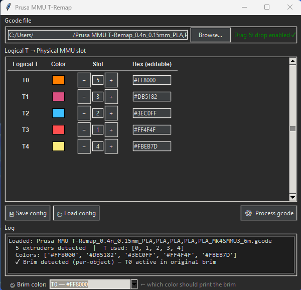

# Prusa MMU T-Remap

<p align="center">
  
</p>

---

This project was born from a frustration shared by many in the Prusa community — not being able to freely choose the print order of your filaments, something competitors like BambuLab offer natively. Not finding any existing project, and with no coding or programming background, I decided to build it myself with the help of Claude AI.

I hope this makes many of you happy.

---

Python post-processor with a GUI for PrusaSlicer gcode on **Prusa FDM printers with MMU2/3** (bgcode is currently not supported).
It remaps T commands to the correct physical cassettes, handles gaps from empty slots, moves the brim color, recognizes already-remapped gcode, and opens automatically after exporting from PrusaSlicer. Developed and tested on an MK4S with both the original MMU3 and a 12-slot modified one.

> ⚠️ Developed and tested on a **Prusa MK4S with the original MMU3 and a 12-slot modified one**. It should work on any Prusa FDM printer with MMU2/3. I have no way to implement support for the INDX or the Prusa XL multi-tool, since I don't own them (they are multi-toolhead systems, different from the single-nozzle MMU). Community feedback on other setups is welcome.

---

## Why this tool exists

PrusaSlicer assigns filament colors to logical extruders (T0, T1, T2…) based on the order you set them up in your project. The physical MMU cassettes have a fixed order (slot 1, 2, 3…). When the two don't match — for example because you want to print the black parts first, but black is physically in cassette 4 — the printer loads the wrong filament.

Prusa MMU T-Remap solves this by rewriting the T commands in the gcode so that each logical extruder maps to the correct physical cassette, without touching anything else in the file.

---

## Features

- **T command remapping** — assign any logical extruder to any physical slot
- **Native purge** — the purge line always uses the first desired print color
- **Empty-slot gap fix** — the firmware renumbers active tools in sequence; an empty slot in the middle makes the printer go to the wipe tower without ever changing color, continuing with the same filament. The tool activates them with a token value of 0.01mm so the firmware sees a correct 1:1 mapping
- **filament used remapping** — updates the `filament used [mm/g]` metadata so the firmware enables all the required tools
- **Brim color relocation** — moves the brim section from the first color to any color you want, keeping the skirt on the first color and with no extra tool changes. The dropdown defaults to the first color (T0): if you don't change it, the brim stays where it was
- **Double-remap protection** — recognizes an already-remapped gcode and warns before reprocessing it, so you don't ruin it by accident with a double remap
- **PrusaSlicer integration** — set the script up as a post-processor; the GUI opens automatically with the gcode already loaded after each export
- **Save dialog with a suggested name** — on export, a dialog appears with the filename pre-filled from the gcode metadata
- **Physical layout config** (`remap_physical.json`) — define your physical slot colors once; the mapping is computed automatically from the gcode's `extruder_colour`
- **Dark / Light theme** — automatically follows your OS theme
- **Drag and drop** (requires `tkinterdnd2`)
- **Save / Load config** — export and reuse slot configurations as JSON

---

## Requirements

- Python 3.10+
- `tkinter` — included with Python on Windows and macOS; on Linux install it separately (e.g. `sudo apt install python3-tk`)
- Optional: `tkinterdnd2` for drag and drop
- Optional: `sv_ttk` for the Windows 11 theme

```bash
pip install tkinterdnd2 sv_ttk
```

---

## Installation

1. Download this repository — click **Code → Download ZIP** and extract, or clone:
```bash
git clone https://github.com/Menelaus-IT/Prusa-MMU-T-Remap.git
```
2. Install the optional dependencies:
```bash
pip install tkinterdnd2 sv_ttk
```
3. Launch the GUI:
```bash
python remap_gui.py
```

On Windows, rename `remap_gui.py` to `remap_gui.pyw` to hide the console window.

---

## Usage

**First of all, in PrusaSlicer:** arrange the extruders (colors) in the order you want them printed — the print order is decided here, in the slicer. The script doesn't change it: after export, you only tell it which physical cassette each color is in.

The script can be used in two ways:

### Manually
1. Open `remap_gui.py` (or drag a gcode file onto it)
2. Load a gcode file via **Browse** or drag and drop
3. For each logical extruder (T0, T1, T2…) set the **physical slot number** where that filament is loaded
4. If a brim is detected, choose which color prints it from the **Brim Color** dropdown
5. Click **Process gcode** — the save dialog appears with the name pre-filled
6. Choose where to save and confirm

### From PrusaSlicer (automatic)
1. In PrusaSlicer go to **Print Settings → Output options → Post-processing scripts**
2. Add:

**Windows:**
```
C:\path\python.exe C:\path\remap_gui.py;
```
Or using `run_remap.bat` (included in the repo — edit the path to your Python and to the script before using it):
```
C:\path\run_remap.bat;
```

3. After each export the GUI opens automatically with the gcode already loaded
4. Set the slots, process and save — the remapped file is ready to print

> **Note:** When opened from PrusaSlicer, the suggested filename will be partial (the project name isn't available in PrusaSlicer's temporary file). Complete the name in the save dialog.

Use **Save config** / **Load config** to reuse slot assignments across sessions.

---

## ⚠️ Important — don't remap an already-remapped gcode

The tool expects a clean gcode, straight from the slicer. If you reprocess one that's already been remapped, the old and new mappings collide and the print comes out wrong (colors load from the wrong cassettes). The tool now **warns you and asks for confirmation** before proceeding — but the rule stands: always start from a fresh slice.

---

## Config formats

**remap_config.json** (explicit mapping, set from the GUI):
```json
[
  {"t": 0, "slot": 4, "hex": "#000000"},
  {"t": 1, "slot": 1, "hex": "#FF0000"},
  {"t": 2, "slot": 3, "hex": "#FFFFFF"}
]
```

**remap_physical.json** (physical layout, auto-mapping):
```json
["#FF0000", "#FFFF00", "#FFFFFF", "#000000"]
```
Slots are 0-indexed. The script matches each `extruder_colour` in the gcode to this list to compute the mapping automatically.

---

## Known firmware behaviors

Prusa firmware behaviors discovered during development:

- **filament_used = 0 stops the print** — the firmware reads `filament used [mm]` to decide which tools to enable. Any tool with 0mm is marked as disabled; if the gcode tries to use it, the printer stops with a red screen and the error `Toolchange to tool that is disabled by tool mapping`
- **Empty slots in the middle break color changes** — the firmware renumbers active tools in sequence; a slot with 0mm in the middle shifts all the following ones by one, making the printer go to the wipe tower without ever changing color, continuing with the same filament
  > **Note:** The tool automatically sets empty slots to 0.01mm instead of 0mm — this makes the firmware consider them active, avoiding both the red-screen error and the wrong sequential mapping. The empty slot is never requested by the print gcode, so the MMU makes no extra movement and the print proceeds normally.

---

## Supported file formats

For now, Prusa MMU T-Remap only supports **gcode** (`.gcode`) files. The bgcode (`.bgcode`) format, the binary format introduced in recent PrusaSlicer versions, is not yet natively supported.

If your PrusaSlicer exports in bgcode, you have two options:

**Option 1 — Disable bgcode in PrusaSlicer (recommended):**
1. In PrusaSlicer go to **Printers → General → Firmware**
2. Uncheck **Supports binary G-code**
3. Exports will produce standard gcode

**Option 2 — Convert bgcode to gcode via the PrusaSlicer G-code Viewer:**
1. Open the `.bgcode` file in PrusaSlicer
2. Go to **File → Convert binary G-code to ASCII**
3. Save as `.gcode` and use that file with the tool

> We're actively working on native bgcode support — see v1.1 in the roadmap.

---

## Roadmap

| Version | Description |
|---------|-------------|
| v1.1 | bgcode support (bgcode → remapped gcode) |
| v1.2 | Multilingual support — more languages can be added by the community |
| v2.0 | Installer (Windows .exe, Linux, macOS .app), bgcode → bgcode output |

---

## Credits

- 12-slot MMU3 mod by [cjbaar](https://github.com/cjbaar/prusa-mmu-12x)
- [Prusa Research](https://www.prusa3d.com)
- Developed with [Claude AI](https://claude.ai) by Anthropic
- Testing support on Prusa MK4S + original MMU3 — [Claide86](https://github.com/Claide86)

---

## Developed with AI assistance

This project was developed in collaboration with Claude (Anthropic). The hardware setup, real-world testing, bug discovery and validation were all carried out by the author on a physical Prusa MK4S with a 12-slot modified MMU3. Claude assisted with the code implementation, debugging and documentation.

All the firmware bugs documented in this project were discovered through real print failures and validated on physical hardware.

---

## Disclaimer

This software is provided "as is", without any warranty. The author takes no responsibility for damage to the printer, wasted filament, failed prints or any other issue arising from the use of this tool. Use at your own risk.

This project is not affiliated with, endorsed by, or connected to Prusa Research a.s. in any way. PrusaSlicer and Prusa are registered trademarks of Prusa Research a.s. This tool merely reads and modifies the gcode files produced by PrusaSlicer.

---

## Contributing

Contributions are welcome. If you have a different number of MMU slots or a different firmware version, open an issue with your sample gcode file — the edge cases in the firmware's tool-mapping behavior are still being documented.

---

## License

This project is distributed under the MIT license — see the [LICENSE](LICENSE) file for details.

<br>

---
---

<br>
